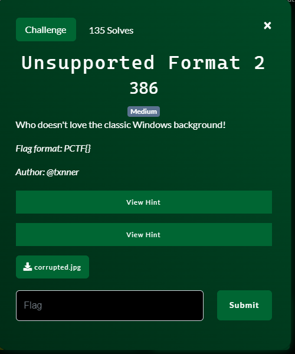
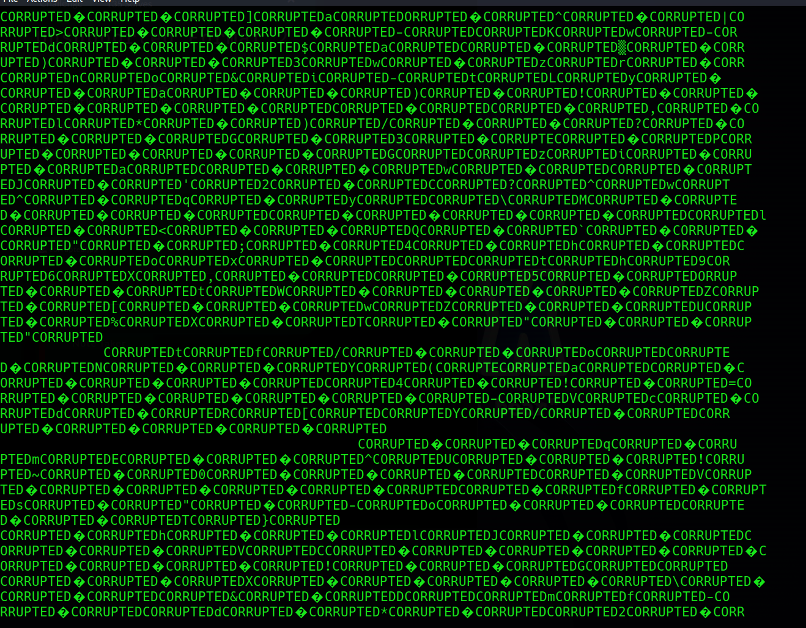
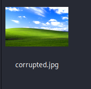
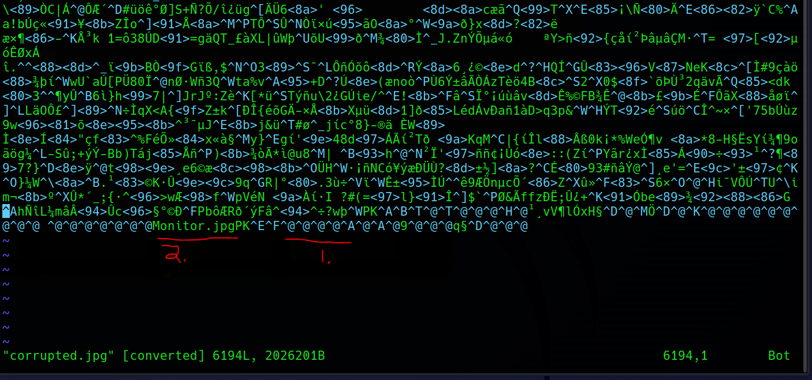
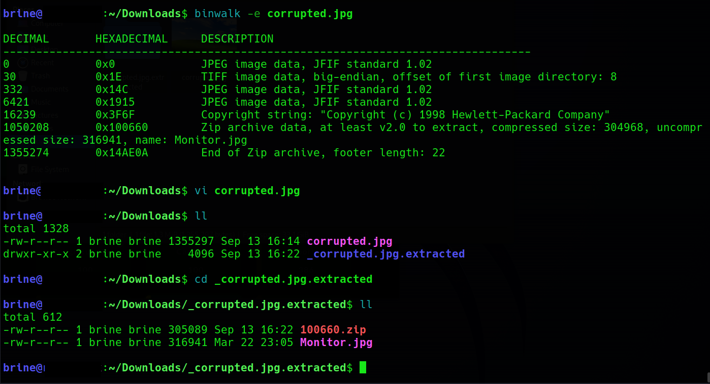
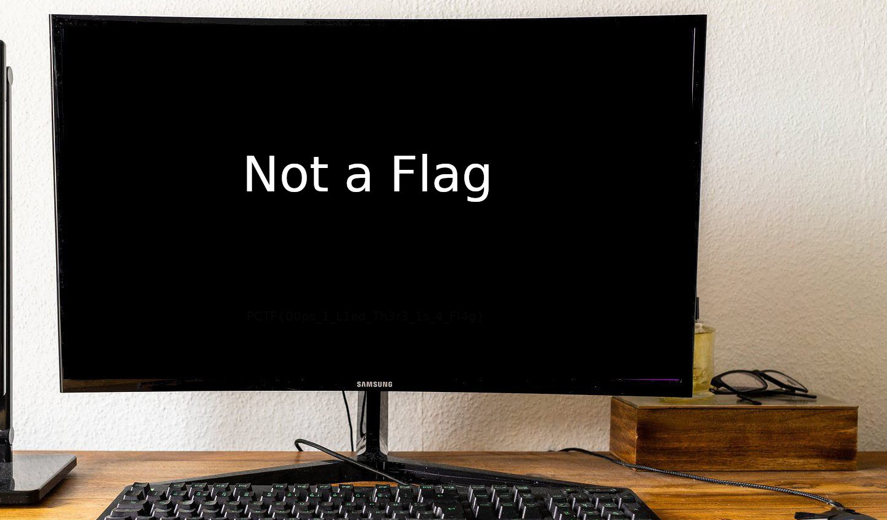
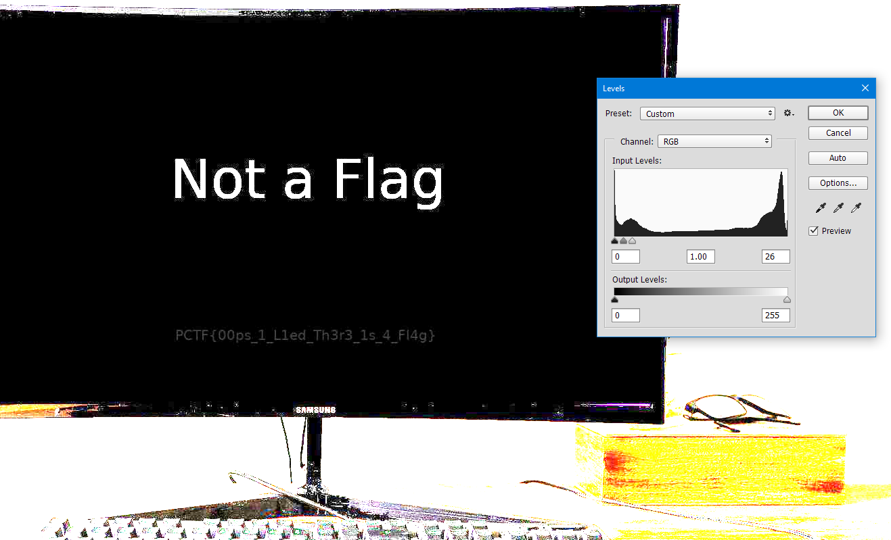

# Unsupported Format 2

By Brine

### Challenge Text 




# Thought Processes

- [ ] I always start by doing a ```cat``` on the file. Great for CTFs and gathering clues.
- [ ] Performing typical forensics on the files got me to the end, but was obstructed by not thinking creatively how they may hide the flag 
- [ ] I was not thinking outside the box for this challenge, and didnt trust my gut when I did. This led to massive slowdowns 
- [ ] I learned that binwalk is an amazinng tool, got a better grip on replace commands in ```vi``` and learned I need to think challenges can be ridiculous and to try everything.

### 1. Corrupt.jpg

As soon as I downloaded the corrupt.jpg, I can safely presume that the file is most likely going to be corrupt. My mind initially thinks I will need to edit some hex signatures but before I do anything I do a 
```bash
$cat corrupt.jpg
```
The result being:
	

	
I decide to try removing the CORRUPTED text from the file:
	
```bash
$vi corrupt.jpg
:%s/CORRUPTED//g
```
	
The result after I write the file:
	

	
	

#### 1.1 Time Suck

At this point, like a fool I thought I was brilliant and the challenge was solved, I just needed to find the flag on this repaired image. At this point I spent an ungodly amount of time using ```exiftool``` ```steghide```and ```exif```
convinced the flag was somewhere in front of me. I took the picture to photoshop and thought about playing with filters and zooming in on pixels looking for a flag but I thought that was dumb and went back to the file. This would bite me later.
Looking back at the file I start thinking that I needed to remove the null characters "^@" as seen numbered "1." in the picture below. I also see the the string "Monitor.jpg" which I thought at the time was supposed to be the proper name 
of the corrupt picture. Removing null characters only corrupted the file again. I decided to take a little break.
	
}
	

### 2. Monitor.jpg

Returning to the file I decided to take another look at ```binwalk```. At the time I didnt realize that a zip, or corrupt file would return different binwalk results. But through 'enumeration,enumeration,enumeration' I was able to locate a hidden archive and extract it.
	


#### 2.1 Time Suck 2
The thumbnail of Monitor.jpg is a picture of a computer monitor with text on it. I assume this is the flag, pop a celebratory beer, and open the pic to claim my prize. My prize: 
	
}
	
I start the entire process laid out in 1.1 over again on this photo and still cannot find anything. Hours later I surrender annd lay down to sleep, when a thought hits me like lightning: I had never tried photoshop like i thought I should.

# Getting the Flag

### 1. Opening the photo in Photoshop I start playing with filters. Dropping the black level down reveals the flag. In hindsight, ```exiftool``` mentioned Photoshop many times. That should have been the giveaway.




### 2. The flag

`PCTF{00ps_1_L1ed_Th3r3_1s_4_Fl4g}`

