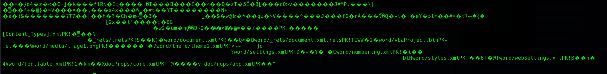
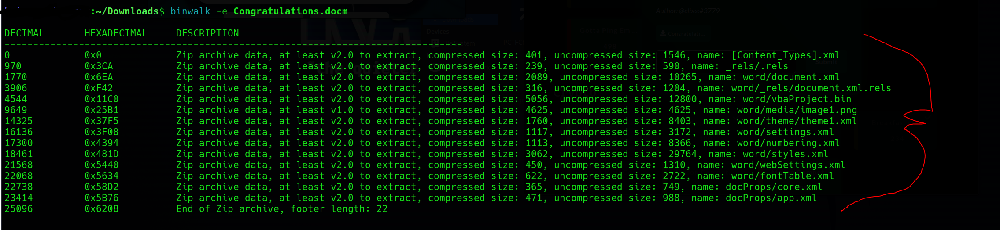
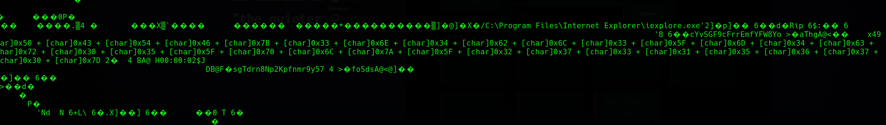
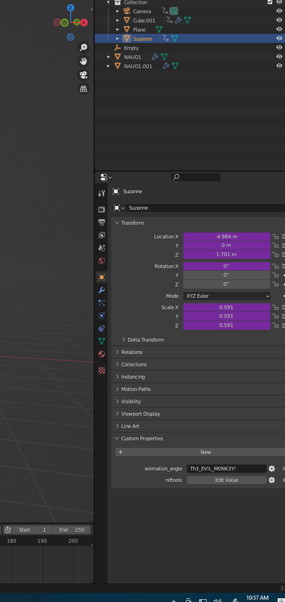
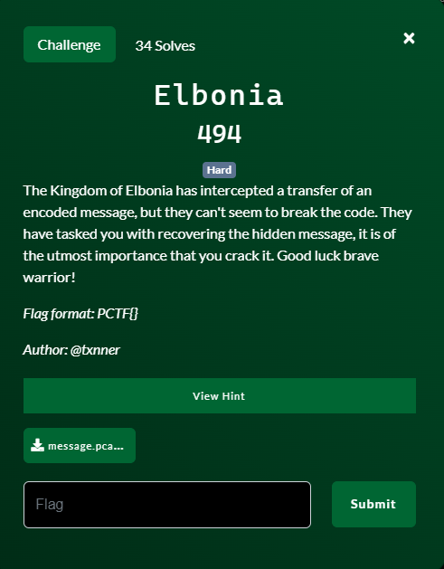
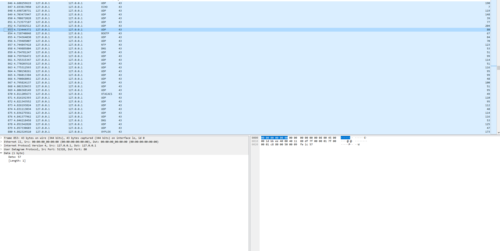

# Table of Contents

- [Unsupported Format 2](#unsupported-format-2)
- [Congratulations.](#congratulations)
- [Evil Monkey 1](#evil-monkey-1)
- [Elbonia](#elbonia)


# Unsupported Format 2

By Brine

### Challenge Text 


# Thought Processes

- [ ] I always start by doing a ```cat``` on the file. Great for CTFs and gathering clues.
- [ ] Performing typical forensics on the files got me to the end, but was obstructed by not thinking creatively how they may hide the flag 
- [ ] I was not thinking outside the box for this challenge, and didnt trust my gut when I did. This led to massive slowdowns 
- [ ] I learned that binwalk is an amazinng tool, got a better grip on replace commands in ```vi``` and learned I need to think challenges can be ridiculous and to try everything.

### 1. Corrupt.jpg

As soon as I downloaded the corrupt.jpg, I can safely presume that the file is most likely going to be corrupt. My mind initially thinks I will need to edit some hex signatures but before I do anything I cat the file
```bash
$cat corrupt.jpg
```
The result being:
	

	
I decide to try removing the CORRUPTED text from the file:
	
```bash
$vi corrupt.jpg
:%s/CORRUPTED//g
```
	
The result after I write the file is a repaired, non-corrupted picture:
	

	
	

#### 1.1 Time Suck

At this point, like a fool I thought I was brilliant and the challenge was solved, I just needed to find the flag on this repaired image. At this point I spent an ungodly amount of time using ```exiftool``` ```steghide```and ```exif```
convinced the flag was somewhere in front of me. I took the picture to photoshop and thought about playing with filters and zooming in on pixels looking for a flag but I thought that was dumb and went back to the file. This would bite me later.
Looking back at the file I start thinking that I needed to remove the null characters "^@" as seen numbered "1." in the picture below. I also see the the string "Monitor.jpg" which I thought at the time was supposed to be the proper name 
of the corrupt picture. Removing null characters only corrupted the file again. I decided to take a little break.
	
}
	

### 2. Monitor.jpg

Returning to the file I decided to take another look at ```binwalk```. At the time I didnt realize that a zip, or corrupt file would return different binwalk results. But through 'enumeration,enumeration,enumeration' I was able to locate a hidden archive and extract it.
	


#### 2.1 Time Suck 2
The thumbnail of Monitor.jpg is a picture of a computer monitor with text on it. I assume this is the flag, pop a celebratory beer, and open the pic to claim my prize. My prize: 
	
}
	
I start the entire process laid out in 1.1 over again on this photo and still cannot find anything. Hours later I surrender annd lay down to sleep, when a thought hits me like lightning: I had never tried photoshop like i thought I should.

# Getting the Flag

### 1. Opening the photo in Photoshop I start playing with filters. Dropping the black level down reveals the flag. In hindsight, ```exiftool``` mentioned Photoshop many times. That should have been the giveaway.


### 2. The flag

`PCTF{00ps_1_L1ed_Th3r3_1s_4_Fl4g}`


# Congratulations

By Brine

### Challenge Text 


# Thought Processes

- [ ] The file they give is is a .docm so I know the file and challenge is going go involve a word macro.

### 1. Congratulations.docm

First thing I do when I download the file is do a ```cat``` on it to see what clues I can find.
	

	
Unsurprisingly I see the .docm has some .xml files inside of it, which is characteristic of a word file, so I use ```binwalk``` to blow the file open and take a look at each:
		

	
Looking through each of these files with ```cat``` I find the main content of the word document in ```document.xml```. This is the same content you would see if you simply moved the doument to windows and 
openend it with Word. The document basically says if you sign the document with docusign you will be presented with a flag. The fact it is a .docm file and the doucment is usp[posedly interactive to get the flag, directs my interest to the macro that performs this function. The macro being: ```vbaProject.bin```.
	

# Getting the Flag

Doing a ```cat``` on the macro this hex catches my eye:
	


Taking a quick peek at the first two characters in an hex to plain text table I see the characters starting to look like the flag and after converting the rest the flag is revealed.


### 2. The flag

`PCTF{3n4bl3_m4cr05_plz_27315670}`


# Evil Monkey 1

By Brine

### Challenge Text 


# Thought Processes

- [ ] Given the crative nature of these challenges so far, I thinnk I should try opening the blender file given to us with blender.

### 1. Blender

Opening the file in Blender we are met with this scene:
	

	
Now there are quite a few ways that people probabaly found the "Evil Monkey" but I happenned to stumble on it just by spinning the camera a bit.
		

	
Since the challenege is called Evil Monkey, and the Monkey was hidden behind the stage I assume this is the thing I should be looking for and start to look through its Properties. Doing so, I find the flag:


	


### 2. The flag

`PCTF{Th3_EV1L_M0NK3Y!}`


# Elbonia

By Brine

### Challenge Text 




# Thought Processes

- [ ] There was no thought utilized for this challenge. I was forced to try every possible solution.

### 1. Wiresharkl

Basically you open the file in Wireshark and see that each line is a single hex of data. I assume that the hex needs to be lined up in a certain way, so I start lookinng for PCTF{ by sorting the captures every way imaginable. After hours of trying every variation of sorting, values, and conversion I find the solution. It was the value of the source ports, in transmission order, decoded from decimal. sigh.
	


### 2. The flag

`PCTF{53cr3t_c0d3_1n_p0rt5}`


